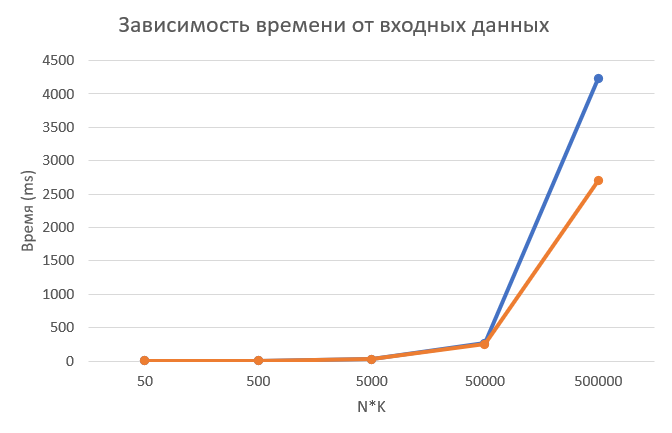

# Лабораторная работа: Префиксная сумма для N векторов из K-элементов
## Задача
реализовать программу для вычисления префиксной суммы для N векторов из K элементов, принимая данные по TCP. Результаты вычислений отправляются обратно через TCP и записываются в файл на стороне сервера, в конце добавляется информация о времени выполнения вычислений и размере обработанных данных.

## Вариант исполнения
Последовательная реализация (на языке C++)

## Описание алгоритма выполнения бизнес-логики
* **Генерация данных:** Серверная часть программы генерирует N векторов, каждый из которых содержит K случайных целых чисел. Данные генерируются утилитой и отправляются клиенту по TCP.

* **Чтение и обработка данных:** Клиентская часть программы получает данные от сервера, парсит их в векторы и вычисляет префиксную сумму для каждого вектора.

* **Запись и отправка результатов:** После выполнения вычислений клиентская программа отправляет результаты обратно на сервер или сохраняет их в файл.

* **Сохранение метаинформации:** В конец файла с результатами добавляется информация о времени выполнения вычислений и размере обработанных данных.

## Код:

### tcp_server.cpp

    #include "tcp.h"

    using boost::asio::ip::tcp;

    // Функция для генерации случайного вектора из K элементов
    std::vector<int> generate_vector(size_t K) {
        std::vector<int> data(K);
        std::random_device rd;
        std::mt19937 gen(rd());
        std::uniform_int_distribution<> dist(1, 100);
        
        for (size_t i = 0; i < K; ++i) {
            data[i] = dist(gen);
        }
        return data;
    }

    // Обработчик клиента
    void handle_client(tcp::socket socket, size_t N, size_t K) {
        try {
            // Время начала работы
            auto start = std::chrono::high_resolution_clock::now();
            
            // Генерация N векторов по K элементов
            {
                std::string message;
                for (size_t i = 0; i < N; ++i) {
                    std::vector<int> data = generate_vector(K);
                    for (int value : data) {
                        message += std::to_string(value) + " ";
                    }
                    message += "\n";
                }

                // Отправка данных клиенту
                TCP::send_data(socket, message);
            }
            
            // Ожидание результата от клиента
            std::string result = TCP::receive_data(socket);
            
            // Время конца работы
            auto end = std::chrono::high_resolution_clock::now();

            // Сохранение результата в файл
            {
                std::chrono::duration<double> duration = end - start;

                // std::ofstream output_file("results.txt", std::ios::app); // Открытие файла в режиме добавления
                std::ofstream output_file("results.txt", std::ios::trunc); // Открытие файла в режиме перезаписи
                if (output_file.is_open()) {
                    output_file << result << "\nN = " << N << "\nK = " << K << "\nВремя выполнения: " << duration.count() << " секунд" << std::endl; // Запись результата
                    output_file.close();
                    std::cout << "Результат сохранен в файл results.txt" << std::endl;
                } else {
                    std::cerr << "Не удалось открыть файл для записи" << std::endl;
                }
            }

        } catch (std::exception& e) {
            std::cerr << "Ошибка при работе с клиентом: " << e.what() << std::endl;
        }
    }

    int main() {
        try {
            boost::asio::io_context io_context;

            // Сервер прослушивает на порту 8080
            tcp::acceptor acceptor(io_context, tcp::endpoint(tcp::v4(), 8080));

            size_t N = 10;  // Количество векторов
            size_t K = 5;  // Количество элементов в каждом векторе

            std::cout << "Сервер запущен и слушает на порту 8080..." << std::endl;

            while (true) {
                // Ожидание подключений
                tcp::socket socket(io_context);
                acceptor.accept(socket);

                // Обработка клиента в отдельном потоке
                std::thread(handle_client, std::move(socket), N, K).detach();
            }

        } catch (std::exception& e) {
            std::cerr << "Ошибка сервера: " << e.what() << std::endl;
        }

        return 0;
    }

### tcp_client.cpp

    #include "tcp.h"

    using boost::asio::ip::tcp;

    // Функция для вычисления префиксной суммы для одного вектора
    std::vector<int> prefix_sum(const std::vector<int>& vec) {
        std::vector<int> result(vec.size());
        result[0] = vec[0];
        for (size_t i = 1; i < vec.size(); ++i) {
            result[i] = result[i - 1] + vec[i];
        }
        return result;
    }

    // Функция для разбора строки в несколько векторов
    std::vector<std::vector<int>> parse_vectors(const std::string& data) {
        std::istringstream iss(data);
        size_t n = 0;
        for (const char& c : data) {
            if (c == '\n') {
                n++;
            }
        }

        int value;
        std::vector<int> tempVector;
        while (iss >> value) {
            tempVector.push_back(value);
        }
        size_t k = tempVector.size() / n;

        std::vector<std::vector<int>> vectors(n, std::vector<int>(k));
        for (size_t i = 0; i < n; ++i) {
            for (size_t j = 0; j < k; ++j){
                vectors[i][j] = tempVector[i * k + j];
            }
        }
        return vectors;
    }

    int main() {
        try {
            boost::asio::io_context io_context;

            // Подключение клиента к серверу
            tcp::resolver resolver(io_context);
            tcp::resolver::results_type endpoints = resolver.resolve("127.0.0.1", "8080");

            tcp::socket socket(io_context);
            boost::asio::connect(socket, endpoints);

            std::string data = TCP::receive_data(socket);

            // Разбор полученной строки в векторы
            std::vector<std::vector<int>> vectors = parse_vectors(data);

            size_t n = vectors.size();
            size_t k = n > 0 ? vectors[0].size() : 0;

            // Вычисление префиксной суммы для каждого вектора
            std::vector<std::vector<int>> result_vectors(n);
            for (size_t i = 0; i < n; ++i) {
                result_vectors[i] = prefix_sum(vectors[i]);
            }

            // Подготовка результата для отправки на сервер
            std::string result_message;
            for (const auto& vec : result_vectors) {
                for (int v : vec) {
                    result_message += std::to_string(v) + " ";
                }
                result_message += "\n";
            }

            // Отправка результата на сервер
            TCP::send_data(socket, result_message);
        } catch (std::exception& e) {
            std::cerr << "Ошибка клиента: " << e.what() << std::endl;
        }

        return 0;
    }

### tcp.h

    #pragma once

    #include <iostream>
    #include <vector>
    #include <sstream>
    #include <fstream>
    #include <boost/asio.hpp>
    #include <thread>
    #include <random>

    namespace TCP{
        using boost::asio::ip::tcp;

        std::string receive_data(tcp::socket& socket) {
            try {
                boost::system::error_code error;

                // Чтение длины сообщения (4 байта)
                uint32_t message_length = 0;
                boost::asio::read(socket, boost::asio::buffer(&message_length, sizeof(message_length)), error);

                if (error) {
                    throw boost::system::system_error(error);
                }

                // Чтение данных на основе длины
                std::vector<char> data(message_length);
                boost::asio::read(socket, boost::asio::buffer(data), error);

                if (error && error != boost::asio::error::eof) {
                    throw boost::system::system_error(error);
                }

                std::string retData = std::string(data.begin(), data.end());
                // Вывод данных
                std::cout << "Полученные данные:\n" << retData << std::endl;

                return retData;
            } catch (std::exception& e) {
                std::cerr << "Ошибка при чтении данных: " << e.what() << std::endl;
            }
            return "";
        }

        void send_data(tcp::socket& socket, const std::string& message) {
            uint32_t message_length = message.size();
            boost::asio::write(socket, boost::asio::buffer(&message_length, sizeof(message_length)));
            boost::asio::write(socket, boost::asio::buffer(message));
            
            std::cout << "Данные отправлены серверу:\n" << message << std::endl;
        }
    }

## График зависимости времени выполнения от размера данных

## Запуск
Отдельно компилируем и запускаем tcp_server.cpp

    g++ tcp_server.cpp -o tcp_server -lboost_system -pthread && ./tcp_server

Затем компилируем и запускаем tcp_client.cpp

    g++ tcp_client.cpp -o tcp_client -lboost_system -pthread && ./tcp_server
