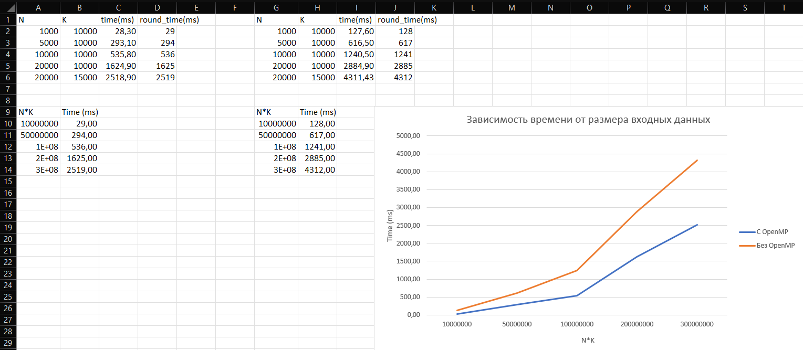

# Лабораторная работа: Префиксная сумма для N векторов из K-элементов
## Задача
реализовать программу для вычисления префиксной суммы для N векторов из K элементов, принимая данные по TCP. Результаты вычислений отправляются обратно через TCP и записываются в файл на стороне сервера, в конце добавляется информация о времени выполнения вычислений и размере обработанных данных.

## Вариант исполнения
Реализация через OpenMP

## Описание алгоритма выполнения бизнес-логики
* **Генерация данных:** Серверная часть программы генерирует N векторов, каждый из которых содержит K случайных целых чисел. Данные генерируются утилитой и отправляются клиенту по TCP.

* **Чтение и обработка данных:** Клиентская часть программы получает данные от сервера, парсит их в векторы и вычисляет префиксную сумму для каждого вектора.

* **Запись и отправка результатов:** После выполнения вычислений клиентская программа отправляет результаты обратно на сервер или сохраняет их в файл.

* **Сохранение метаинформации:** В конец файла с результатами добавляется информация о времени выполнения вычислений и размере обработанных данных.

## График зависимости времени выполнения от размера данных



## Графики при разных входных данных и разных количеств тредов


## Запуск
Отдельно компилируем и запускаем tcp_server.cpp
```
g++ -std=c++20 -Wall server.cpp tcp.cpp generator.cpp -o server -lboost_system -pthread -fopenmp
./server
```

Затем компилируем и запускаем tcp_client.cpp
```
g++ -std=c++20 -Wall client.cpp tcp.cpp generator.cpp -o client -lboost_system -pthread -fopenmp
./client <N> <K> <количество повторений данных (для подсчета среднего времени)>
```
